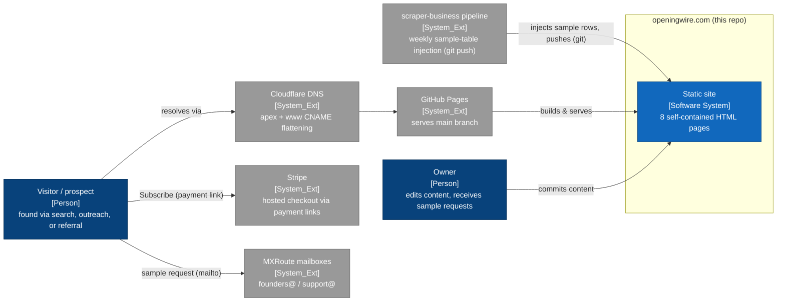
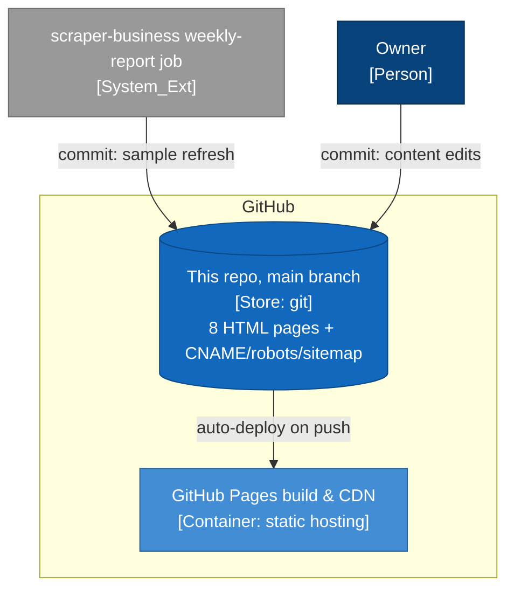

# openingwire.com — Architecture Brief

The static marketing and conversion site for OpeningWire, served by GitHub
Pages at https://openingwire.com. It sells the weekly Texas venue-intelligence
feed produced by the companion pipeline repo (Clear-Mind-Systems/scraper-business,
which has its own ARCHITECTURE.md).

> Generated from commit `c35396c` on 2026-07-28 by the `architecture-brief`
> skill (vendored in the scraper-business repo at
> .claude/skills/architecture-brief/SKILL.md). Staleness check:
> `git diff c35396c..HEAD --stat`.

## 1. At a glance

- **Purpose**: convert visitors into subscribers (Stripe payment links) and
  sample requesters (mailto CTAs), and capture search traffic for
  new-restaurant/TABC queries via SEO landing pages.
- **Quality attributes, prioritized**: (1) zero operations — no build step, no
  runtime JavaScript, nothing to break unattended; (2) $0 hosting — GitHub
  Pages + Cloudflare DNS (`README.md`); (3) freshness signal — every page's
  sample table is refreshed weekly by the pipeline bot; (4) SEO.
- **Hard constraints**: static files only (GitHub Pages, no server code); every
  page is fully self-contained HTML with inline CSS; content changes arrive as
  git commits (owner or pipeline bot) — there is no CMS.
- **Key tradeoffs**:
  - Chose **hand-written static HTML over any framework/build step** — the
    whole site is 8 pages; a toolchain would add the only thing that can break.
  - Chose **Stripe payment links over a Stripe code integration** — checkout is
    three `href`s in `index.html` (`README.md` "Swapping CTAs"), so the site
    needs no secrets and no backend.
  - Chose **push-based content refresh** (pipeline commits into this repo) over
    the site fetching data — keeps the site static and the data path auditable.

## 2. System context



*Blue = this system, gray = external. C4 level: Context.*

| External system | Role | Touched by |
|---|---|---|
| scraper-business repo (pipeline) | Pushes weekly sample rows into every marker page — per-metro, statewide, or pending-tracker rows per page — and stamps changed pages' sitemap lastmod (its pipeline/site_sample.py PAGE_PROFILES, weekly-report workflow, authenticated by a SITE_PUSH_TOKEN secret held there) | sample-marker regions in `index.html` and each landing page; `sitemap.xml` |
| GitHub Pages | Hosting; serves the `main` branch as-is | `CNAME` (custom domain) |
| Cloudflare DNS | Apex/www CNAME to clear-mind-systems.github.io | records documented in `README.md` |
| Stripe | Hosted checkout; no code integration | three buy.stripe.com `href`s in `index.html` `id="pricing"` |
| MXRoute | Destination of mailto CTAs (sample requests, support) | mailto links in `index.html` and page footers |
| Search engines | Crawl targets of the SEO pages | `robots.txt`, `sitemap.xml`, JSON-LD blocks in each landing page |

## 3. Capabilities → pages

| Capability | Page(s) | Notes |
|---|---|---|
| Pitch, live sample, pricing, FAQ | `index.html` | The only page with Stripe CTAs and the pipeline-refreshed sample table |
| Metro SEO capture ("new restaurants in X") | `new-restaurants-houston/index.html`, `new-restaurants-dallas/index.html`, `new-restaurants-austin/index.html`, `new-restaurants-san-antonio/index.html` | Metro-filtered sample rows, JSON-LD, canonical URLs; marked `seo-pages:v1` |
| Intent SEO capture | `pre-opening-restaurant-leads-texas/index.html`, `tabc-license-application-tracker/index.html`, `restaurant-activity-report-alternative/index.html` | Product-intent and competitor-alternative queries |
| Legal | `privacy.html`, `terms.html` | Linked from footers |
| Crawler plumbing | `robots.txt`, `sitemap.xml` | Sitemap lists all 8 pages; lastmod auto-stamped by the weekly injection for refreshed pages |

## 4. Containers

A single deployable unit: the repository itself, built and served by GitHub
Pages. There is no CI in this repo (no workflows directory) — deployment is
Pages' automatic build on push to `main`.



*Blue = this system, gray = external. C4 level: Container.*

## 5. APIs & interfaces

The site consumes nothing at runtime — there is no executable JavaScript (the
only `<script>` blocks are JSON-LD structured data) and no external asset
loads; every page inlines its CSS.

**Exposed / contractual surfaces**

| Interface | Consumer | Defined in |
|---|---|---|
| `<!-- SAMPLE:START -->` / `<!-- SAMPLE:END -->` marker regions | The pipeline's injector (pipeline/site_sample.py in scraper-business), which replaces everything between the markers per page profile and fails loudly if an existing page loses its markers | `index.html` and every landing page |
| Three Stripe payment-link `href`s (founding/standard/multi-territory) | Visitors; owner swaps URLs per `README.md` | `index.html` `id="pricing"` |
| Sample-request mailto (founders@, metro in body template) | Visitors → owner's MXRoute inbox | `index.html` hero CTA |
| Public URL set | Search engines, subscribers | `sitemap.xml` |

## 6. Data surface

No database. The only structured data is the sample-table row, whose shape is a
contract with the pipeline's renderer (pipeline/site_sample.py):

| Column | Example | Source in pipeline |
|---|---|---|
| Venue | "Hat Creek Burger Company" | `venues.trade_name`, title-cased |
| Type | Restaurant / Bar & Club | `venues.category` |
| Status | Newly Licensed | `venues.stage` |
| City / Metro | Fulshear / Houston | `venues.city`, `venues.metro` |
| Licensed | "Jul 24" | `venues.issue_date` |

Changing the homepage table's columns or the marker comments breaks the weekly
injection — treat both as an interface, not styling.

## 7. Key runtime flows

### 7.1 Weekly sample refresh (the only automated write)

```mermaid
sequenceDiagram
    participant W as weekly-report job (scraper-business)
    participant R as this repo (main)
    participant P as GitHub Pages
    W->>R: checkout with SITE_PUSH_TOKEN
    W->>W: render per-profile rows from pipeline DB; inject every marker page; stamp sitemap lastmod
    Note over W,R: push only when the injector reports CHANGED
    W->>R: commit "weekly sample refresh" + push
    R->>P: Pages auto-build on push
    P-->>P: live at openingwire.com within minutes
```

### 7.2 Purchase and sample-request paths

Both are zero-backend: **purchase** is a click-through to Stripe's hosted
checkout (payment links in `index.html`); **sample request** is a prefilled
mailto to founders@, answered by the owner using the pipeline repo's
samples CSVs and reply template (see that repo's outreach/ directory).

All eight marker pages are refreshed by the weekly job (pipeline change
`refresh-all-site-sample-pages`, 2026-07-28): the four metro pages get
metro-filtered licensed rows, the tracker page gets pending applications, the
rest get statewide licensed rows, and changed pages' `sitemap.xml` lastmod is
stamped in the same commit. Adding or removing a landing page must be
mirrored in the pipeline's page-profile map, or the new page silently won't
refresh (removal is safe — the injector skips absent pages with a warning).

## 8. Deployment & operations

- **Hosting**: GitHub Pages, `main` branch, custom domain `openingwire.com`
  via `CNAME`; HTTPS enforced after certificate issuance (`README.md`).
- **DNS**: Cloudflare, apex + `www` CNAME-flattened to
  clear-mind-systems.github.io (`README.md` table).
- **No secrets in this repo** — the push credential (SITE_PUSH_TOKEN) lives in
  the scraper-business repo's Actions secrets.
- **Rollback** = `git revert` + push; Pages redeploys automatically.

## 9. Crosscutting conventions

- Every page is self-contained: inline `<style>`, system font stack, no
  external requests — a page can be previewed by opening the file.
- SEO pages share a generation marker (`seo-pages:v1` comment), canonical
  URLs, meta descriptions, and JSON-LD blocks; keep these consistent when
  adding pages, and add new pages to `sitemap.xml`.
- Sample-table row markup (tag spans `r`/`new`) must match what the pipeline
  renderer emits — change them together.
